<div align="center">


<br/>

[](https://www.linkedin.com/in/vitor-vargem-52291b184/)


</div>

---

## 💫 Sobre mim

Olá! 👋 Sou **Vitor**, **Software Engineer na TOTVS**, onde atuo no desenvolvimento e na inovação do **TOTVS Legal** e do **Protheus** como responsável técnico dos produtos. Construo aplicações front-end em **Angular + PO UI** que rodam dentro do ecossistema Protheus e venho unindo o mundo ERP à **Inteligência Artificial**, de agentes de IA e integrações ADVPL/TLPP com LLMs a modelos de Machine Learning em Python.

```typescript
const vitor: Developer = {
  nome: "Vitor Vargem",
  cargo: "Software Engineer @ TOTVS",
  produtos: ["TOTVS Legal", "Protheus"],
  local: "Guarulhos - SP 🇧🇷",
  diaADia: ["Angular", "PO UI", "TypeScript", "ADVPL", "TLPP", "Python"],
  copilotos: ["Claude Code", "Gemini", "ChatGPT", "Ollama"],
  estudando: ["Machine Learning", "Agentes de IA", "LLMs locais"],
  objetivo: "Liderar times de desenvolvimento de software e IA 🚀",
};
```

---

## 🚀 O que eu faço de melhor

- 👥 **Liderança & Mentoria** — Liderança de equipe, mentoria técnica e comportamental de programas de aceleração de carreira, responsável técnico por produtos e participação no Comitê de IA TOTVS.
- ⚙️ **Ecossistema TOTVS** — Apps Angular + PO UI empacotados em `.app` para o SmartClient, builds Angular 17+ compatíveis com o Protheus e troubleshooting do runtime Chromium embarcado (CEF).
- 🧩 **ADVPL / TLPP** — Fontes, classes, funções e APIs REST no Protheus, incluindo integrações com modelos de linguagem (LLMs).
- ✨ **IA Generativa** — Criação de agentes de IA, engenharia de prompt, desenvolvimento assistido por IA e LLMs locais, tanto prontas quanto desenvolvidas por mim para minhas próprias necessidades.
- 🧠 **Machine Learning** — Motores de scoring multifatorial, clusterização e predição com scikit-learn, Pandas e NumPy.
- ☁️ **Dados & BI** — Dashboards analíticos com Google Cloud, BigQuery e Looker Studio.
- 🔐 **Autenticação** — Login com Google OAuth e controle de acesso por allowlist.
- 🖥️ **Desktop** — Sistemas em C# / .NET Windows Forms com arquitetura em camadas e GUIs Python com Tkinter.
- 🤖 **Automação** — Scripts Python para processamento em lote de vídeos com FFmpeg, manipulação de PDFs com PyMuPDF e leitura de planilhas.
- 🎨 **UI/UX** — Interfaces dark premium, glassmorphism e dashboards orientados a dados.

---

## 🧭 Trajetória

| | Função | Empresa | Período |
|:--:|:--|:--|:--|
| 💼 | **Software Engineer** — desenvolvimento e inovação do TOTVS Legal e Protheus, responsável técnico dos produtos | TOTVS | ago/2026 → atual |
| 🛠️ | **Suporte Técnico de Desenvolvimento ADVPL/TLPP** · Membro do **Comitê de IA** do Suporte | TOTVS | jun/2024 → ago/2026 |
| 🎓 | **Monitor Técnico de Desenvolvimento de Software** — responsável pela turma do programa Start Tech, com mentoria técnica e comportamental | TOTVS | nov/2024 → abr/2025 |
| 🖥️ | **Técnico de Suporte** | Escola Natasha Franco Vieira | set/2022 → jun/2023 |
| 👥 | **Líder de Equipe** — gestão das atividades diárias da equipe e dos setores da loja | Miniso Brasil | nov/2018 → mar/2020 |

---

## 🎓 Formação & Certificações

**Formação acadêmica**
- 🧠 **Inteligência Artificial e Machine Learning** — UniCesumar *(2026 – 2028, em andamento)*
- 🎓 **Tecnólogo em Análise e Desenvolvimento de Sistemas** — Faculdade Eniac *(concluído em 2025)*

**💻 Certificações técnicas & IA**
- ✨ **Estado da IA Generativa**
- ✨ **Otimizando Tarefas com Gemini**
- 🏅 **TOTVS** — Desenvolvimento Front-End (Angular, TypeScript, JavaScript, HTML, CSS & SCSS)
- 🏅 **HCode** — Desenvolvimento de APIs com Node.js e MongoDB
- 🏅 **Direto ao Ponto** — Desenvolvimento de RPA
- 🏅 **Curso em Vídeo** — Python
- 🏅 **Instituto da Oportunidade Social** — Desenvolvimento Web

**🔄 Metodologia Ágil**
- 🏅 **TOTVS** — Agilidade WKS *(programa Start Tech)*

**🧑‍🤝‍🧑 Liderança & Soft Skills**
- 🏅 **Relacionamento Interpessoal e Gestão de Conflitos**
- 🏅 **Lidar com Ansiedade** — inteligência emocional sob pressão
- 🎖️ **TOTVS Start Tech** — Formação em postura profissional, carreira e marketing pessoal, com acompanhamento comportamental

**🌟 Soft skills**


---

## 💻 Tech Stack

<div align="center">


</div>

<br/>

| Categoria | Tecnologias |
|:--|:--|
| **🗣️ Linguagens** |        |
| **🎨 Frontend** |         |
| **⚙️ Backend** |     |
|  **Ecossistema TOTVS** |         |
| **✨ IA Generativa** |   ![ChatGPT](https://img.shields.io/badge/ChatGPT-10A37F?style=for-the-badge&logo=data%3Aimage%2Fsvg%2Bxml%3Bbase64%2CPHN2ZyBmaWxsPSJ3aGl0ZSIgZmlsbC1ydWxlPSJldmVub2RkIiB2aWV3Qm94PSIwIDAgMjQgMjQiIHhtbG5zPSJodHRwOi8vd3d3LnczLm9yZy8yMDAwL3N2ZyI%2BPHBhdGggZD0iTTkuMjA1IDguNjU4di0yLjI2YzAtLjE5LjA3Mi0uMzMzLjIzOC0uNDI4bDQuNTQzLTIuNjE2Yy42MTktLjM1NyAxLjM1Ni0uNTIzIDIuMTE3LS41MjMgMi44NTQgMCA0LjY2MiAyLjIxMiA0LjY2MiA0LjU2NiAwIC4xNjcgMCAuMzU3LS4wMjQuNTQ3bC00LjcxLTIuNzU5YS43OTcuNzk3IDAgMDAtLjg1NiAwbC01Ljk3IDMuNDczem0xMC42MDkgOC44VjEyLjA2YzAtLjMzMy0uMTQzLS41Ny0uNDI5LS43MzdsLTUuOTctMy40NzMgMS45NS0xLjExOGEuNDMzLjQzMyAwIDAxLjQ3NiAwbDQuNTQzIDIuNjE3YzEuMzA5Ljc2IDIuMTg5IDIuMzc4IDIuMTg5IDMuOTQ4IDAgMS44MDgtMS4wNyAzLjQ3My0yLjc2IDQuMTYzek03LjgwMiAxMi43MDNsLTEuOTUtMS4xNDJjLS4xNjctLjA5NS0uMjM5LS4yMzgtLjIzOS0uNDI4VjUuODk5YzAtMi41NDUgMS45NS00LjQ3MiA0LjU5MS00LjQ3MiAxIDAgMS45MjcuMzMzIDIuNzEyLjkyOEw4LjIzIDUuMDY3Yy0uMjg1LjE2Ni0uNDI4LjQwNC0uNDI4LjczN3Y2Ljg5OHpNMTIgMTUuMTI4bC0yLjc5NS0xLjU3di0zLjMzTDEyIDguNjU4bDIuNzk1IDEuNTd2My4zM0wxMiAxNS4xMjh6bTEuNzk2IDcuMjNjLTEgMC0xLjkyNy0uMzMyLTIuNzEyLS45MjdsNC42ODYtMi43MTJjLjI4NS0uMTY2LjQyOC0uNDA0LjQyOC0uNzM3di02Ljg5OGwxLjk3NCAxLjE0MmMuMTY3LjA5NS4yMzguMjM4LjIzOC40Mjh2NS4yMzNjMCAyLjU0NS0xLjk3NCA0LjQ3Mi00LjYxNCA0LjQ3MnptLTUuNjM3LTUuMzAzbC00LjU0NC0yLjYxN2MtMS4zMDgtLjc2MS0yLjE4OC0yLjM3OC0yLjE4OC0zLjk0OEE0LjQ4MiA0LjQ4MiAwIDAxNC4yMSA2LjMyN3Y1LjQyM2MwIC4zMzMuMTQzLjU3MS40MjguNzM4bDUuOTQ3IDMuNDQ5LTEuOTUgMS4xMThhLjQzMi40MzIgMCAwMS0uNDc2IDB6bS0uMjYyIDMuOWMtMi42ODggMC00LjY2Mi0yLjAyMS00LjY2Mi00LjUxOSAwLS4xOS4wMjQtLjM4LjA0Ny0uNTdsNC42ODYgMi43MWMuMjg2LjE2Ny41NzEuMTY3Ljg1NiAwbDUuOTctMy40NDh2Mi4yNmMwIC4xOS0uMDcuMzMzLS4yMzcuNDI4bC00LjU0MyAyLjYxNmMtLjYxOS4zNTctMS4zNTYuNTIzLTIuMTE3LjUyM3ptNS44OTkgMi44M2E1Ljk0NyA1Ljk0NyAwIDAwNS44MjctNC43NTZDMjIuMjg3IDE4LjMzOSAyNCAxNS44NCAyNCAxMy4yOTZjMC0xLjY2NS0uNzEzLTMuMjgyLTEuOTk4LTQuNDQ4LjExOS0uNS4xOS0uOTk5LjE5LTEuNDk4IDAtMy40MDEtMi43NTktNS45NDctNS45NDYtNS45NDctLjY0MiAwLTEuMjYuMDk1LTEuODguMzFBNS45NjIgNS45NjIgMCAwMDEwLjIwNSAwYTUuOTQ3IDUuOTQ3IDAgMDAtNS44MjcgNC43NTdDMS43MTMgNS40NDcgMCA3Ljk0NSAwIDEwLjQ5YzAgMS42NjYuNzEzIDMuMjgzIDEuOTk4IDQuNDQ4LS4xMTkuNS0uMTkgMS0uMTkgMS40OTkgMCAzLjQwMSAyLjc1OSA1Ljk0NiA1Ljk0NiA1Ljk0Ni42NDIgMCAxLjI2LS4wOTUgMS44OC0uMzA5YTUuOTYgNS45NiAwIDAwNC4xNjIgMS43MTN6Ij48L3BhdGg%2BPC9zdmc%2B)   |
| **🧠 Dados & ML** |    |
| **☁️ Cloud & Bancos** |       |
| **🤖 Automação** |     |
| **🧰 Ferramentas & Deploy** |          |

---

## 📊 GitHub Stats

<div align="center">


</div>

## 🏆 GitHub Trophies

<div align="center">



</div>

---

## ⚡ Fora do código

- 🏠 Curto automação residencial com **Raspberry Pi**
- 📚 Estudo **psicologia, psicanálise e neurologia** para entender a mente humana
- 🎯 Meta: chegar à **gestão de times de desenvolvimento de software e IA**

---

<div align="center">

### 🤝 Vamos conversar?

[](https://www.linkedin.com/in/vitor-vargem-52291b184/)


</div>
